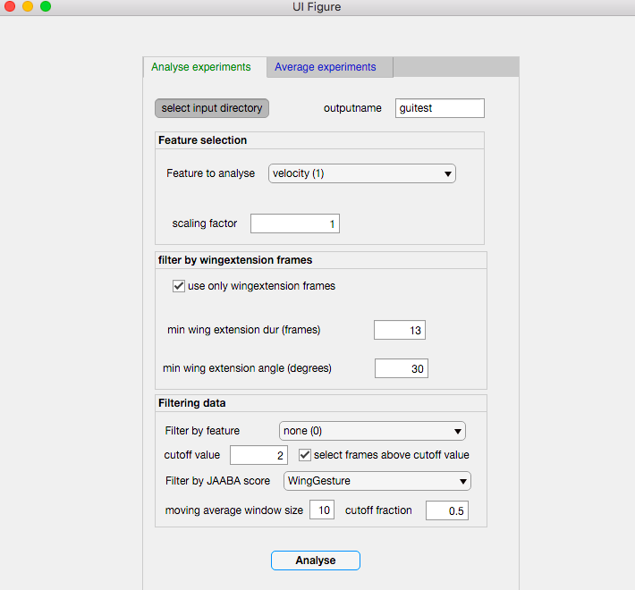
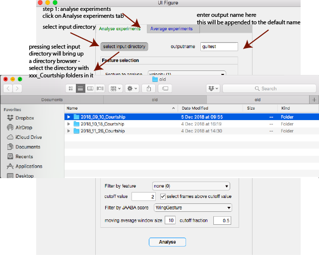
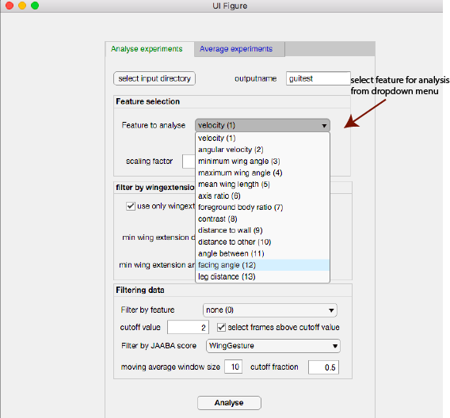
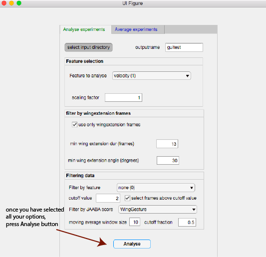
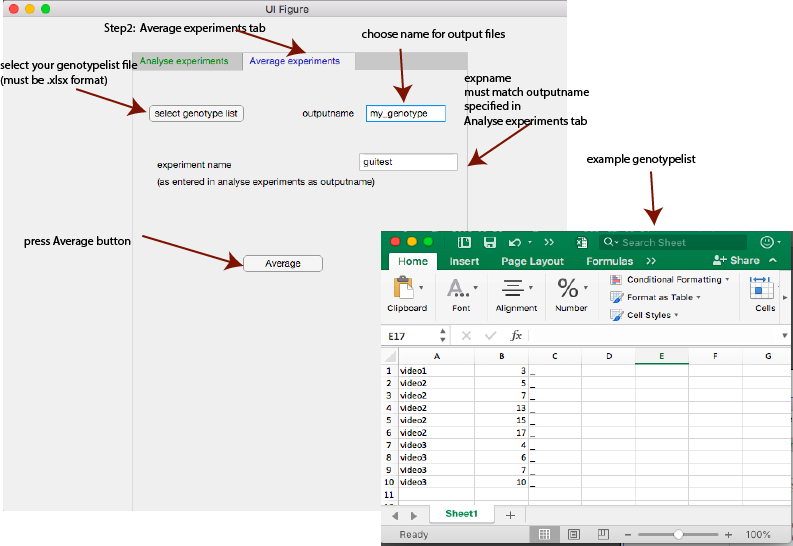

# Short User Guide
### Annikas Tracking Scripts

This is a collection of MATLAB scripts for post-tracking data analysis of fly courtship videos tracked with the Goodwin Lab tracking system. The package includes a preliminary GUI, which is likely to be modified. Check for updates frequently.

All functions can still be called from the MATLAB command line or a custom matlab script. 

## Requirements
* MATLAB R2016a or later. MATLAB R2017a or later recommended.
* All of the scripts in this package need to be in the MATLAB path
* Boundedline package available from:

https://www.mathworks.com/matlabcentral/fileexchange/27485-boundedline-m

* IsOdd package available from:

https://www.mathworks.com/matlabcentral/fileexchange/2006-isodd

## Usage
1. Track your videos with the Goodwin Lab Tracking System
  
2. Download your entire results folder (which should be called: XXX_Courtship)

3. Open MATLAB and navigate to the folder that contains your Courtship directories (to the folder that contains the folders called xxxx_xx_xx_Courtship)

4. Choose your analysis and run it as described below

## GUI usage:

To launch the GUI, type in the command window:

`pdfplot`

or click on the pdtplot.mlapp file

The gui looks like this:

### Analyse experiments tap

* click on "select input directory" and select the directory that contains your xxx_Courtship directories
* enter a name for our experiment, for example: facingangle
* if you want to scale the output, enter a scaling factor (has to be a number)

* select a feature from the dropdown menu

* if you want to analyse only wingextension frames, select the checkbox and enter duration and angle for wingextension
* if you want to remove copulation frames, check the box (not currently displayed in the picture above)
* if you want additional filtering, select the column you want to filter by and enter a cutoff value, decide whether values above or below that value are to be selected
* press analyse

### Average experiments tap

* click on the select genotype list button and select your genotypelist (must be xlsx format)
* enter the outputname
* enter the experiment name you previously entered as an output name when doing the analysis step
* press Average

## Calling functions from the command line:

## Making probability density plots of features

Decide what you want to plot. These are the options (with their respective feature column numbers):
* Velocity =1;
* Angular Velocity =2;
* Minimum wing angle =3;
* Maximum wing angle =4;
* Mean Wing angle =5;
* Axis Ratio =6;
* Foreground Body Ratio =7;
* Contrast =8;
* Distance to wall =9;
* Distance to the other fly =10;
* Angle between =11;
* Facing Angle =12;
* Leg Distance =13;

Experiments with 1 fly per chamber will have only features 1-9.

Run the run_pdfplots_any function in the Matlab command window by typing:

`run_pdfplots_any(EXPNAME,NUMBER,optional key-value pair arguments)`

### Required and optional arguments:

### Required arguments:

EXPNAME = what you want the experiment to be called (one word only please) Datatype: string

NUMBER = the number of the feature column you want to plot as indicated above. Datatype: integer

### Key-value-pair arguments: are optional, if entered, the key has to be in single quotes like this: ‘key’ and is followed by a comma , and its value. The following keys are defined (their default values are indicated in brackets and are used if not specified):

SCALING: scaling to be applied to the data (default = 1) Datatype: double (a  numeric type)

WINGDUR: minimum number of contiguous frames of wing extension to be
counted as wing extension bouts (default = 13) Datatype: integer

WINGEXTONLY: use only wing extension frames (default = true) Datatype: Bool
Wingextonly is true by default if no other options are specified, false if fromscores or specificframes or filterby are specified.

MINWINGANGLE: minimum angle of the wing to body axis (in degrees) to be counted as wing extension (default = 30) Datatype: double

REMOVECOP: whether copulation frames should be removed (default = true) Datatype: Bool

### The following apply to JAABA scores and are used only if fromscores is set to true:

SCORE: name of the score from JAABA (if fromscores is set to true) (default = WingGesture) Datatype: string

WINDOWSIZE: size of the moving average window (in frames, default = 13) Datatype: integer

CUTOFFRAC: fraction of the frames that have to be positive for the event
in the specified window (default = 0.5) Datatype: Double

FROMSCORES: if true, the data are taken from a JAABA scores file (default = false) Datatype: Bool

### Analysing only specific tracking frames

SPECIFICFRAMES: if true, it expects a .csv file that contains the start
nd end frames of the frame ranges that should be analyzed. Several frame ranges can be
specified, starting from column 3 in the .csv file. Each pair of 2 columns
has to be a pair of start and endframes for the desired range.
The flyID needs to be in column 2
The file has to be located in
the video directory and be called '<videoname>_frames.csv' where videoname
is the name of the videodirectory it is in. (default false)
if specificframes is set to false (default), copulationframes are removed (for 2-fly experiments)

### Filtering frames by a different feature

FILTERBY: column number (of the feat.mat file) which should be used for
filtering frames. Must be a number between 1-13 (between 1-9 for single fly experiments). Allows for additional
filtering. (default: no additional filtering)

CUTOFFVAL: if filterby is selected, this is the value above or below which
the feature should be for the frames to be selected. (default:2)

ABOVE: if filterby is selected, this specifies whether you want to use
frames that are above or below cutoffval (default: true, meaning values have to be above)

A probability density plot is created for each fly in all the videos in all the folders ending in ‘Courtship’ and saved to a subdirectory called ‘pdfs’

### Averaging probability density plots

To average all the pdfs from one genotype, use the following function:

`find_videos_new (genotypelist,path,expname,structname,genotype)`

### The arguments are (all arguments are required):

GENOTYPELIST = the .xlsx file containing the experiments – must be entered in single quotes and including the file extension like this: ‘myfile.xlsx’ Dataype: string

PATH=path to the subdirectory that contains the pdfdata - directory that
must contain .mat files with structures called pdfdata in them – is currently called ‘pdfs’ and has to be entered like that with single quotes Datatype: string

EXPNAME=name of the field in the structure that contains the desired data – this is the same as you used when running the run_pdfplots_any function (in single quotes). Datatype: string

STRUCTNAME = name of the structure in the .mat file that gets loaded it is currently called ‘pdfdata’ (enter it including the single quotes) Datatype: string

GENOTYPE = genotype of the flies - is only used for labelling the figure(and
naming the output file) you can enter whatever you want here (in single quotes like ‘my_genotype’) Datatype: string

To use this function, you first need to make a genotypelist in Excel that contains the flies that belong to the same genotype, which you want to average, ending in the fileextension .xlsx with the following structure:

*Column 1: videoname (This can be either your original video name or the full name with the extensions created by the tracker)
*Column 2: fly-id
*Column 3: delimitor (for now, use _ )

### Examples:

Suppose you want to plot probability distributions of the velocity of the flies, in all frames where they don’t copulate, not just the wing extension frames.
Navigate to the folder that contains the Courtship directories and type:

`run_pdfplots_any(‘velocity’,1,’wingextonly’,false)`

when it’s finished, make an excel table as outlined above. Assuming your table is called ‘simfemales.xlsx’, and you want the output to be called ‘SimulansFemales’, type the following:

`find_videos_new(‘simfemales.xlsx’,’pdfs’,’velocity’,’pdfdata’,’SimulansFemales’)`

If you want to plot the facing angle only in wing extension frames, and you want the wing extension to be taken from the JAABA classifier WingGesture, assuming you want 50% of frames in a window of 13 frames to be positive for it to be counted as wing extension, and you want to convert the angles from radients to degrees type the following:

`run_pdfplots_any(‘facingangle’,12,’scaling’,(180/pi),’fromscores’,true)`

when it’s finished, make an excel table as outlined above. Assuming your table is called ‘males.xlsx’, and you want the output to be called ‘males’, type the following:

`find_videos_new(‘males.xlsx’,’pdfs’,’facingangle’,’pdfdata’,’males’)`

## Calculating Distance travelled

Run the following in the MATLAB command line:

`run_distance_travelled(dur)`

DUR: duration for how long you want to calculate the distance travelled in s. Must not exceed the total tracking time of the video.

## Averaging distance travelled

Run the following in the MATLAB command line:

`find_videos_dist (genotypelist, genotype)`

### Required arguments:

GENOTYPELIST = the .xlsx file containing the experiments – must be entered in single quotes and including the file extension like this: ‘myfile.xlsx’ Dataype: string

see above for requirements for this file

GENOTYPE = genotype of the flies - is only used for labelling the figure(and
naming the output file) you can enter whatever you want here (in single quotes like ‘my_genotype’) Datatype: string

### Examples:

Run distance travelled for 15 min (=900s):

`run_distance_travelled(900)`

Averaging:

`find_videos_dist ('my_genotype.xlsx', 'my_genotype')`

## Calculating bilateral wing extension

Run the following in the MATLAB command line:

`find_videos_bilateral(genotypelist, genotype)

### Required arguments:

GENOTYPELIST = the .xlsx file containing the experiments – must be entered in single quotes and including the file extension like this: ‘myfile.xlsx’ Dataype: string

see above for requirements for this file

GENOTYPE = genotype of the flies - is only used for labelling the figure(and
naming the output file) you can enter whatever you want here (in single quotes like ‘my_genotype’) Datatype: string

### Examples:

calculate and average bilateral wing extension:

`find_videos_bilateral('my_genotype.xlsx', 'my_genotype')`

## Averaging the indices produced by the tracker in the Results.csv table

Run the follwoing in the MATLAB command line:

`find_videos_indices(genotypelist, genotype)

### Required arguments:

GENOTYPELIST = the .xlsx file containing the experiments – must be entered in single quotes and including the file extension like this: ‘myfile.xlsx’ Dataype: string

see above for requirements for this file

GENOTYPE = genotype of the flies - is only used for labelling the figure(and
naming the output file) you can enter whatever you want here (in single quotes like ‘my_genotype’) Datatype: string

### Examples:

calculate and average bilateral wing extension:

`find_videos_indices('my_genotype.xlsx', 'my_genotype')`

## Averaging the indices for the other fly in the chamber

Assume you have made a genotypelist with IDs of your experimental females, but you now want to calculate the Courtship index (or other indices) for the corresponding control males that were in the chamber with your experimental females. Without making a new genotypelist that contains the FlyIds for the males, you can run the following function:

Run the follwoing in the MATLAB command line:

`find_videos_indices_other(genotypelist, genotype)`

### Required arguments:

GENOTYPELIST = the .xlsx file containing the experiments – must be entered in single quotes and including the file extension like this: ‘myfile.xlsx’ Dataype: string

see above for requirements for this file

GENOTYPE = genotype of the flies - is only used for labelling the figure(and
naming the output file) you can enter whatever you want here (in single quotes like ‘my_genotype’) Datatype: string

### Examples:

calculate and average bilateral wing extension:

`find_videos_indices_other('my_genotype.xlsx', 'my_genotype')`

## Calculating the Wing extension Index from the tracking data

Wing extension index is generally calculated from the scores of the JAABA classifier. If instead you want to calculate it from the tracking data, defining wing extension as at least one wing being extended > 30 deg, run either one of the following:

`run_wing_index_tracking`

or

`run_wing_index_tracking_allframes`

The former removes copulation frames and uses the criterion of wing extension having to persist for at least 13 frames, whereas the latter uses all frames in the tracking period. Run these scripts (without arguments) from your directory that contains the XXX_Courtship directories. It will create a directory called "wingindex" with your data for each fly in it.

### Averaging the Wing Extension data

run the following:

`find_videos_wingindex(genotypelist, genotype)`

### Required arguments:

GENOTYPELIST = the .xlsx file containing the experiments – must be entered in single quotes and including the file extension like this: ‘myfile.xlsx’ Dataype: string

see above for requirements for this file

GENOTYPE = genotype of the flies - is only used for labelling the figure(and
naming the output file) you can enter whatever you want here (in single quotes like ‘my_genotype’) Datatype: string

### Examples:

`find_videos_wingindex('my_genotype.xlsx', 'my_genotype')`

## Finding out the indices of flies based on relative chamber positions in first frame

Assume you know which genotype fly you loaded on the left and right side of the recording chamber, you can determining their assigned FlyIds as follows:

While in the directory that contains the XXX_XX_XX_Courtship directories, run the following script in the MATLAB command line:

`run_left_right`

This will add a 'videoname_left_right.csv' file to all your Results folders, which contains a table with the flyIds and 'l' for left or 'r' for right. The information refers to their relative positions to each other in the first tracking frame. 

